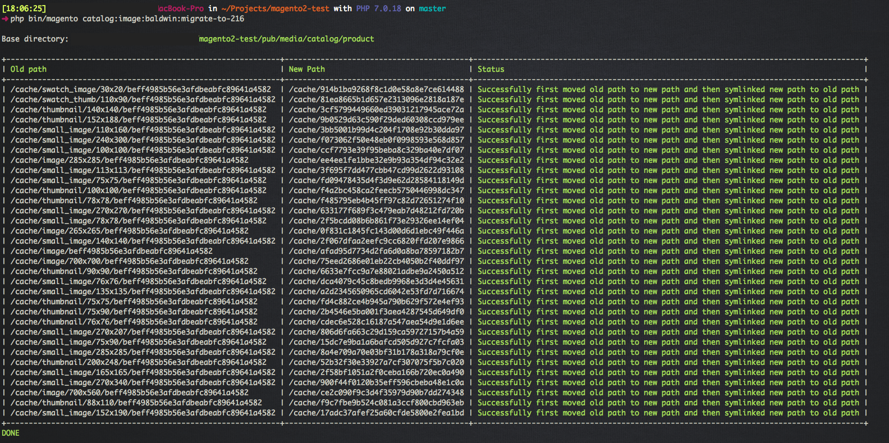

# Magento 2 module aimed to ease the migration of resized images from Magento 2.1.4 or 2.1.5 to 2.1.6

## LATEST INFO

Magento version 2.1.7 was released which [reverts all the image resizing changes](http://devdocs.magento.com/guides/v2.1/release-notes/ReleaseNotes2.1.7CE.html#highlights) which were introduced in version 2.1.6, so this module has no reason to exist anymore. Please don't use this anymore, unless you know what you are getting yourself into :)

## Disclaimer

This module is super experimental, wasn't yet thoroughly tested on a real-world Magento project, use at own risk!

If some Magento employee comes along this and finds incorrect information or bugs, feel free to contact me or open an issue. Feedback from Magento devs would be highly appreciated!

## The problem

Ok, so Magento released version 2.1.6. A couple of issues they addressed was about resizing product images. Here are some bullet points from the [Release Notes](http://devdocs.magento.com/guides/v2.1/release-notes/ReleaseNotes2.1.6CE.html):

> - The storefront now displays images that Magento resizes during product save operations, rather than resizing the product on the storefront. Previously, the image path contained store_id, and during save operations, Magento resized images for images the default store only.
>
> - image resize operations performed from the command line interface now generate images of all sizes. See magento catalog:images:resize for more information.
> - image resize operations from the Admin have been fixed
>
> - significant decrease in the number of file system operations when processing images on frontend

This all sounds really great and should indeed increase frontend page loading speed when resized images didn't exist before.  
But these changes introduced a problem: all images on the product listing pages are broken when upgrading to version 2.1.6.

So maybe let's first take a look at how Magento generated resized images before version 2.1.6, then how it was changed in 2.1.6, and then explain the problem why when you upgrade to version 2.1.6 you don't see any images anymore on the product listing pages. And then finally some explanation about how this module tries to address this problem.

### Before Magento 2.1.6
For as far as I know, there were 3 different ways resized images were generated:

- When you saved a product
- When you ran `bin/magento catalog:images:resize`
- When you visited a page in the frontend which needed to display a resized image, and the image didn't exist yet

According to the quoted release notes above, there were some problems where certain images didn't get resized when saving a product, which then caused performance issues when loading a page on the frontend where an image wasn't already resized before.
Now, on the one hand, it is great there is this fallback like this, because this way we can always be sure that all images will be displayed. But the downside is, that it causes a slowdown for the first visitor of that particular page.

### Changes in Magento 2.1.6

Magento 2.1.6 tries to address this problem, by making sure all possible resized images are being generated when saving a product, or when running `bin/magento catalog:images:resize`.
This is mostly correct (except for a new bug [reported by @airdrumz](https://github.com/magento/magento2/issues/9276#issuecomment-295691637), but that's beside the question).  
2.1.6 also disabled resizing images on the frontend, since in theory, you shouldn't need to do this any longer, since all images should already exist before loading a page.

The other big change, is how Magento creates the directory structure as to where the images are being stored in the filesystem.
Before 2.1.6, this used to be something like: `pub/media/catalog/product/cache/1/image/642x829/e9c3970ab036de70892d86c6d221abfe/`, where the directory structure contained a storeview id, the type of the image, the resolution and a hash of some parameters thrown together, which should make the hash unique for every different manipulation you can perform on a certain image (rotation, bg color, watermark, ...)
In 2.1.6, this path changes to something like: `pub/media/catalog/product/cache/054cdce737e4fd5dce52bb5ae351a76f`. So the only thing that remains in the directory structure is a hash of a bunch of parameters, including type of image, width & height, watermarks, and so on...

### Problems when upgrading to 2.1.6

Now, the above changes cause a very big problem, since after you upgraded to version 2.1.6, Magento starts to search for resized images in a completely different filestructure then what you currently have. And since no more images get generated on the frontend, all images are broken on your webshop (well on the product listing that is, on the product detail pages, images are still being generated on the frontend).

The solution to this, according to Magento, is to run the `bin/magento catalog:images:resize` command and that will generate all missing resized images.

And that's true indeed. If you have a small shop with maybe 10 or 100 products and not that much images, that's a good solution. It takes a while though, if you run it on the sample data, it takes about 30 minutes.

The problem is webshops with tons and tons of products and images, say something like 20.000 products where each product has at least 2 or 3 images. When you have to run `bin/magento catalog:images:resize` on such a webshop, it will keep running for days on end, maybe even longer then a week (untested).

### The solution presented by this module

This module tries to ease this migration pain, by figuring out how the pre-2.1.6 directory structure was formed and then try to map this to the new directory structure of 2.1.6.
Currently we assume you install this module on a 2.1.4/2.1.5 installation, run a command which moves the old directory structure to the new one, and then places symlinks where the old directory structure is supposed to be and links them to the new filestructure. In this way, the old 2.1.4/2.1.5 Magento will continue to show images, as it uses the symlinks which points to the correct images. And after you upgraded your shop to 2.1.6, it uses the new directory structure, so after the 2.1.6 upgrade went successfull, you can then cleanup the symlinks this module created.

Well, that's the general idea behind this, this was very briefly tested on a real-world Magento project, but not very thoroughly enough yet to be able to declare this module stable (and certainly not very clean, the code is a mess currently).
So again: use at your own risk.

## How to use this module

**Please, test this on a second environment _before_ trying this on a production environment!**

1. Make sure your webshop is running Magento 2.1.4 or 2.1.5 (it might work on older versions, but we didn't bother testing this, the composer constraints are very strict, so it shouldn't install on any other version then 2.1.4 - 2.1.6)
1. Run `bin/magento catalog:images:resize` so most images will already be generated in the old directory structure (this might take a couple of minutes/hours/days, depending on how many images your store has)
1. Install and enable this module (TODO: add composer instructions)
1. Run `bin/magento catalog:image:baldwin:migrate-to-216`, it will present you with some output about what was done, or if some errors were encountered (see below for screenshot)
1. Upgrade Magento to 2.1.6
1. Test your shop, and hopefully all images show up on the product listing pages (if not, then this module doesn't work in your specific case, or you've run into a bug in this module)
1. If everything went successfull, you can remove the symlinks which were generated by this command (TODO: we should add another command in this module to automate this)
1. Finally, run `bin/magento catalog:images:resize` once again, just to be sure you have all the necessary resized images in the new directory structure

## Example output

## Roadmap

- As mentioned above, there is a [new bug introduced by 2.1.6](https://github.com/magento/magento2/issues/9276#issuecomment-295691637), where a hidden image being used on the product listing aren't getting generated, and there is no way to generate them currently, unless you hack the Magento core code, we might include a fix in this module for this problem.
- Magento's `bin/magento catalog:images:resize` command is very inefficient and can be optimized to run faster and create less files, this is explained in [issue 8145](https://github.com/magento/magento2/issues/8145), we might include some fixes for those in this module (I suggested in the issue to remove the `image_type` field, but that will cause another change in the directory structure again, since that field is used to create the hash. Instead of removing the field, I would now suggest to change this to some hardcoded value, which is being used by 2.1.6, like `thumbnail` for example, this then shouldn't cause new backwards compatible issues)
- I think some people would appreciate it that the fallback of creating images on the frontend when they don't exist yet, is re-enabled, we might include a fix in this module for this. (this should accidentally also fix the first bullet point on the roadmap)

## Other info

There are other issues in Magento 2.1.6, where a frame/border around your images might appear, Magento published a [Technical Bulletin](http://devdocs.magento.com/guides/v2.1/release-notes/tech_bull_216-imageresize.html) for this.
I'm not sure yet if this will cause problems with this module, because you might have different `view.xml` files between 2.1.4/2.1.5 and 2.1.6, which can result in different hashes in the directory structure, so I'm not sure if this module should be able to handle different `view.xml` files. Some extra research around this still needs to happen.
